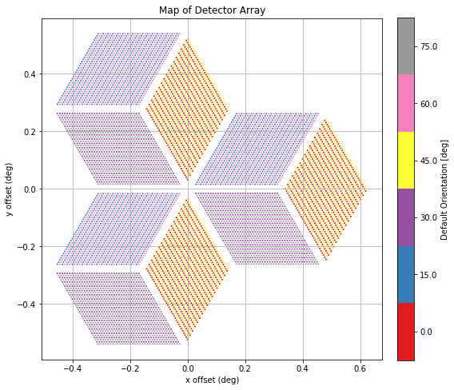
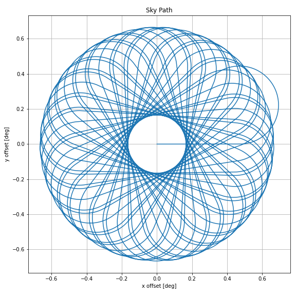
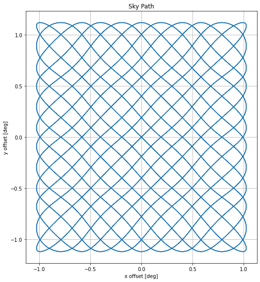
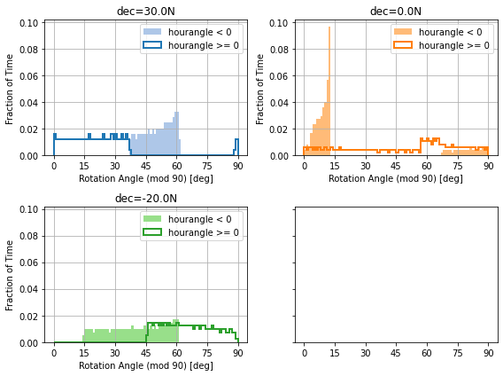

###########################
Visualization 
###########################

Camera Modules and Instruments
====================================

Below are a list of visualization functions and examples and examples for visualzing camera modules and instruments. 

.. autofunction:: scanning.visualization.plot_module

.. autofunction:: scanning.visualization.instrument_config

.. image:: images/instrument_config.png
    :width: 500

Scan Patterns
====================================

Below are a list of visualization functions and examples for visualzing scan patterns. 

.. autofunction:: scanning.visualization.sky_path

.. image:: images/sky_path.png
    :width: 300

.. autofunction:: scanning.visualization.telescope_path

.. image:: images/telescope_path.png
    :width: 500

.. autofunction:: scanning.visualization.telescope_kinematics

.. image:: images/telescope_kinematics.png
    :width: 500

.. autofunction:: scanning.visualization.sky_kinematics

.. image:: images/sky_kinematics.png
    :width: 500

Simulations
====================================

Below are a list of visualization functions and examples for visualzing simulation outputs. 

.. automodule:: scanning.visualization
    :members: hitmap, pxan_detector, pxan_time, pxan_polarization, polarization_histogram

Observations
====================================

Below are a list of visualization functions and examples for visualzing :py:class:`~scanning.observation.Observation` objects.

.. autofunction:: scanning.visualization.filter_observation

.. image:: images/filter_observation.png
    :width: 500

.. autofunction:: scanning.visualization.field_rotation_hist

